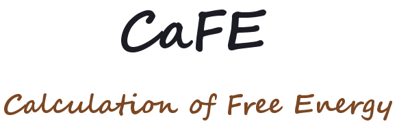

Introduction
-----------------------------------

CaFE (Calculation of Free Energy) is a VMD plugin for binding affinity
prediction using end-point free energy methods.

Availability & Implementation
-----------------------------------

You can use CaFE on all major platforms.

* Source code: https://github.com/HuiLiuCode/CaFE_Plugin

Documentation
-----------------------------------

* Manual: https://github.com/HuiLiuCode/CaFE_Plugin/tree/master/doc/manual.pdf

Installation
-----------------------------------

Please see the user manual for details about installation.

License
-----------------------------------

CaFE is freely available under the GNU General Public License. See LICENSE
for more details.

